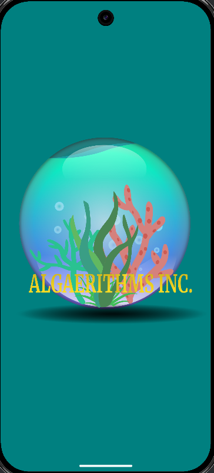
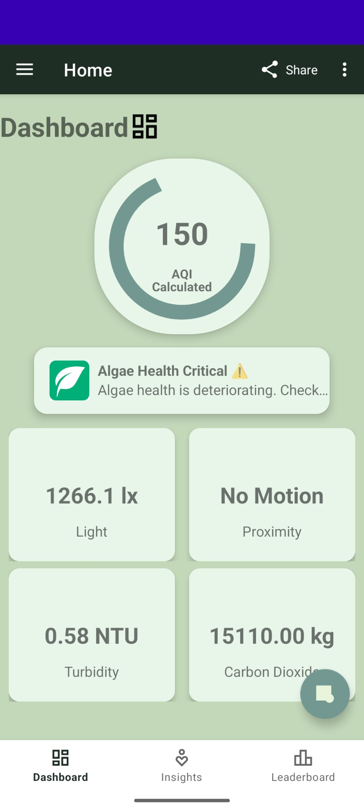
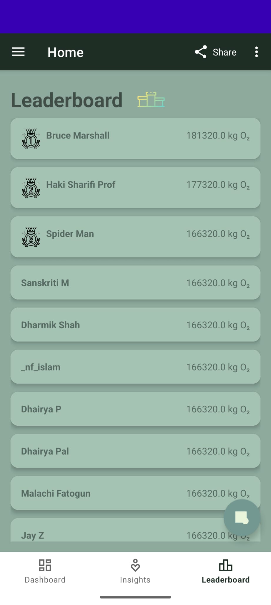
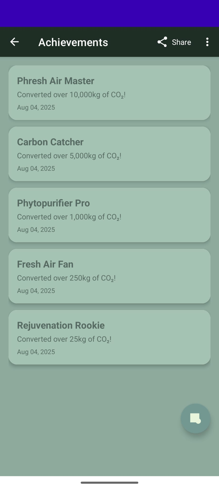
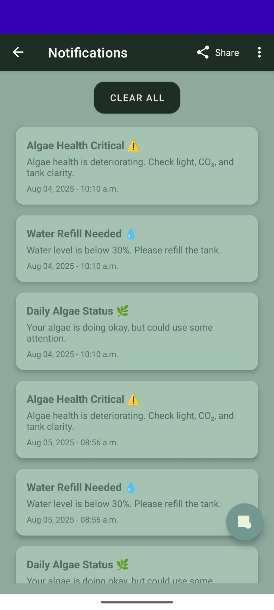
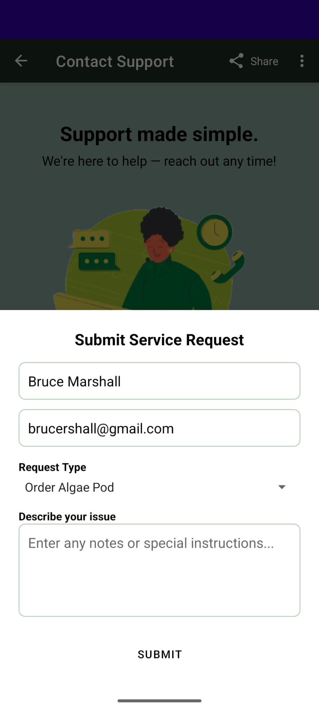
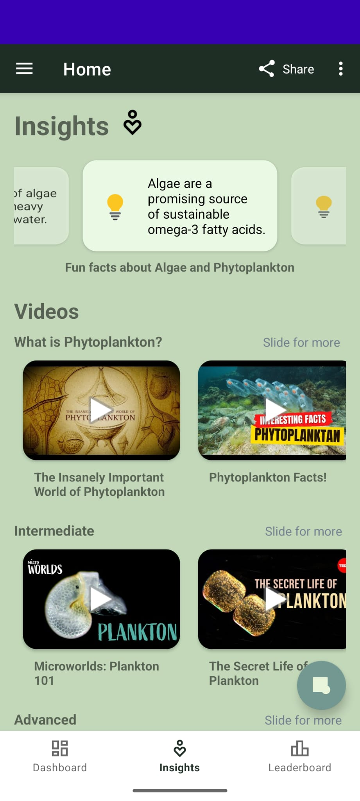
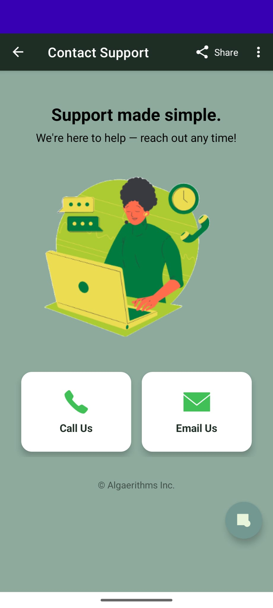

# Phytoplankton-based Air Systems by Algaerithms Inc.

Dhairya Pal (N01576099), Sanskriti Mansotra (N01523183), Dharmik Shah (N01581796), Julian Imperial (N01638310)

## Overview

This Android app is a part of a bigger project - an air purification system. My team and I called this system "Phytoplankton-based Air Systems" because we used a plant that is one of the most efficient in producing oxygen - Phytoplanktons, and we used our sensors and actuators to monitor its growth and have it produce oxygen day and night, successfully milking it to produce the most amount of oxygen with the expense of it dying just a tid bit early than if we hadn't milked it so much, but the ROI is enormous over this small loss. The other part of the project includes a hardware system (with four sensors and actuators), running 24x7 and updating sensors values in Firebase database at all times. The Android app:
1) Retrieves these values from Firebase and shows it to the user through a Dashboard page, also dynamically calculating the AQI score.  
   

2) Has a Leaderboard functionality where other users who buy our product can compete based on the kilograms of oxygen their product produces.  
   

3) Has an Achievements page that shows all the achievements the user has received (based on the amount of oxygen produced by their product), and the user can also share their stats summary with other users using a custom-view.  
   

4) Has a Notifications page that shows all past user notifications so user can track the history of any critical change they had to serve for their product.  
   

5) Alerts the user if anything is wrong (i.e., the algae is dying, there's not enough sunlight to promote optimal algae growth, algae needs water replacement, etc.).  

6) Inbuilt features to contact support, request servicing, change UI settings, create/delete account, and insights on phytoplanktons and their own product.  
     
     
   