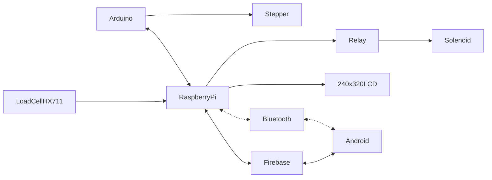

# Brief CENG Capstone Project Charter
-  [x] Select Project area:
1. [ ] :bike: Facilities: e.g. Bicycle Rental/Parking Lot/Vision System
2. [X] :factory: Building Automation: e.g. Greenhouse/SolarPanel/Home
3. [ ] :movie_camera: Consumer: e.g. Entertainment Protocol DMX/Baby Monitoring Project
4. [ ] :mortar_board: Education: e.g. Robust Hackable Educational Project
5. [ ] :robot: Robotics: e.g. Control/Navigation/Dashboard
6. [ ] :ski: Health and Wellness: e.g. Wearable
####  Project Title: 
Phtyoplankton Air Systems

####  Executive Summary/Description of the Project (75 to 100 words): 
Write here

####  Has this project been approved by all parties for posting (Y/N)?
-  [x] Yes
-  [ ] No

Optional Collaborator fields for sponsored projects

#### Sponsoring Industry and Personnel: 
#### Hours contributed: 
#### Number of full-time employees, year established, private or not-for-profit: 
#### Value of equipment or access to equipment provided: 
#### FAST contribution: 

####  List of Names of Students Involved in Project (first and last names and separate members by a comma):
Dhairya Pal , Dharmik Shah , Sanskriti Mansotra , Julian Imperial

####  Planned contact email for the [Expo submission form](https://appliedtechnology.humber.ca/shows/past-shows/advanced-manufacturing-projects/advanced-manufacturing-student-submission-form.html)
algaerithms@gmail.com

####  For each individual student state whether they have a complete parts kit, a multimeter, what development platform they have, what sensors/effectors they have along with system Requirements (List what sensors/effectors are to do), functionalty of prototype/describe any unsoldered connections.
Dhairya Pal:
- [X] Complete parts kit
- [X] Multimeter
- Development platform: Broadcom single board computer
- Sensor/effector 1:
  - Device name: ENS160
  - Product page (e.g. Sparkfun, Adafruit, etc.): https://www.sparkfun.com/sparkfun-indoor-air-quality-sensor-ens160-qwiic.html
  - Purchase page (e.g. DigiKey): https://www.amazon.ca/dp/B0C5W1BZ9D?ref=ppx_yo2ov_dt_b_fed_asin_title
  - I2C address: 0x53
  - DEV_ID: N/A
  - Additional device specific components: N/A
  - Additional device specific connections in addition to or instead of Qwiic cable: N/A
  - Current hardware operational status: Working

Dharmik shah:
- [ ] Complete parts kit
- [ ] Multimeter
- Development platform: Broadcom single board computer
- Sensor/effector 2:
  - Device name: VCNL4040
  - Product page (e.g. Sparkfun, Adafruit, etc.): [Adafruit](https://cdn-learn.adafruit.com/downloads/pdf/adafruit-vcnl4040-proximity-sensor.pdf)
  - Purchase page (e.g. DigiKey): [DigiKey](https://www.digikey.ca/en/products/detail/adafruit-industries-llc/4161/10385108)
  - I2C address: 0x60
  - DEV_ID: 0x0C
  - Additional device specific components: N/A 
  - Additional device specific connections in addition to or instead of Qwiic cable: N/A 
  - Current hardware operational status: Working

Sanskriti Mansotra:
- [X] Complete parts kit
- [X] Multimeter
- Development platform: Broadcom single board computer
- Sensor/effector 3:
  - Device name: VEML7700
  - Product page (e.g. Sparkfun, Adafruit, etc.): https://cdn-learn.adafruit.com/downloads/pdf/adafruit-veml7700.pdf
  - Purchase page (e.g. DigiKey): https://www.digikey.ca/en/products/detail/adafruit-industries-llc/4162/9997696?gclsrc=aw.ds&gad_source=1&gad_campaignid=20282404290&gbraid=0AAAAADrbLlgb33Lb2MxvjYhNOyZSEkYXy&gclid=Cj0KCQjwzt_FBhCEARIsAJGFWVnNxIzPZ2PS6lpKk6FcE1x_dCFN113ok93nwYnkMsO39PVfBe7RxNUaAoXxEALw_wcB
  - I2C address:0X10
  - DEV_ID:0XC4
  - Additional device specific components: Null
  - Additional device specific connections in addition to or instead of Qwiic cable: Null
  - Current hardware operational status: Sensor is successfully reading data

Julian Imperial:
- [X] Complete parts kit
- [x] Multimeter
- Development platform: Raspberry Pi 4 Model B board
- Sensor/effector 4:
  - Device name: Turbidity Analog Sensor SEN0189 
  - Product page (e.g. Sparkfun, Adafruit, etc.): www.digikey.ca/en/products/detail/dfrobot/SEN0189/6588606gclsrc=aw.ds&gad_source=1&gad_campaignid=20282404290&gbraid=0AAAAADrbLlhtQts8HJgnXl2jxkrNm2T3a&gclid=Cj0KCQjwzt_FBhCEARIsAJGFWVm_BUKU786abOgYVQXVEWSL6feuxPm5rUfMZHT0aFPRHzPob3ny-WwaAoBBEALw_wcB
  - Purchase page (e.g. DigiKey): https://www.amazon.ca/dp/B00KLBTXME?ref=ppx_yo2ov_dt_b_fed_asin_title (For ADS1015 Converter)
  - I2C address: 0x48
  - DEV_ID: Turbidity sensor SKU: SEN0189 DFRobot
  - Additional device specific components: ADS1015 (0x48), SEN0189 Water Probe 
  - Additional device specific connections in addition to or instead of Qwiic cable: 3 Female to Male Connectors 
  - Current hardware operational status: Working

####  GitHub repository link(s):
[PhytoplanktonAirSystems](https://github.com/Algaerithms-Inc/PhytoplanktonAirSystems.git)

####  Google Play App download link:
[Example link - EZPARK](https://play.google.com/store/apps/details?id=ca.ezlock.it.ezpark&pli=1)

#### Hours per student:
$14\*3=42$ in class hours, $14\*3=42+$ outside of class.

#### Supervising Faculty: 
Kris Medri   

####  Hours per faculty: 
$14\frac{3}{20}\*3=6.3$ in class, $14\frac{1.05+1.49}{20}\*3=5.334+$ outside of class.

####  Scope:
Creation of a Prototype that is not to be left powered unattended. Keeping safety and Z462 in mind, the highest AC voltage that is to be used is 16Vrms from a wall adapter from which +/- 15V or as high as 45 VDC can be obtained. Maximum power consumption is to be 20 Watts. In alignment with the space below the tray in the Humber North Campus Electronics Parts kit the overall project maximum dimensions are 12 13/16" x 5 ¹/₂" x 2 ³/₄" = 32.5cm x 14cm x 7cm. If your PCB doesn’t work or you need to switch sensors/effectors, it is recommended that you use the SparkFun Qwiic system: https://www.sparkfun.com/products/15945

####  Design approach:

####  Mandate: 
Self funded (unless a sponsor has contractually agreed to contribute).
